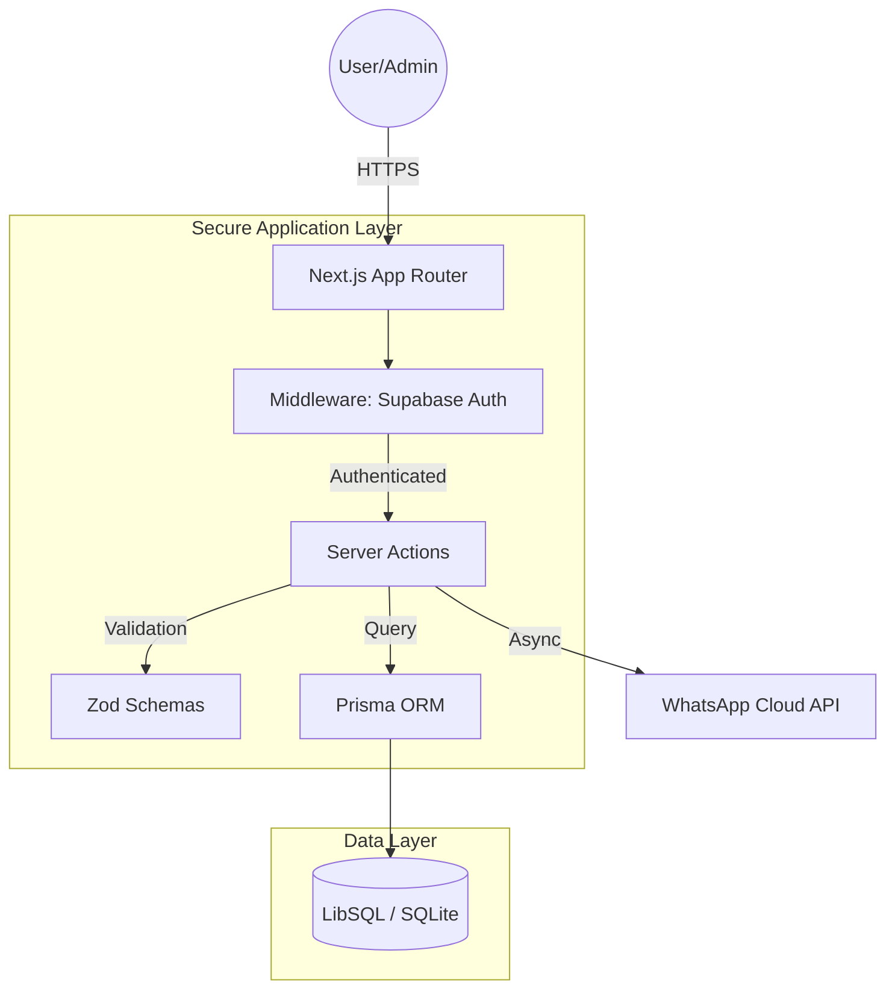

# LuminaMIS — Advanced Institute Management System

LuminaMIS is a comprehensive, enterprise-grade administrative platform designed for modern educational institutions. It provides a centralized hub for managing the entire student lifecycle, institutional finances, and staff operations with high precision and security.

## 🏗️ System Architecture

LuminaMIS utilizes a cutting-edge full-stack architecture built on Next.js 15, ensuring seamless data flow and robust security.

## 🔄 Business Logic & Data Flow

### 🔐 Authentication Layer
The system implements a **Zero-Trust** security model for all administrative functions.
- **Session Management**: Handled via Supabase SSR with secure, encrypted cookies.
- **Middleware Protection**: Every route is protected at the edge, verifying JWT tokens before reaching server components.
- **Action Hardening**: Server actions (like `login`) implement rigorous input type checking and sanitization.

### 💸 Financial Processing
The financial engine ensures 100% accuracy in ledger management.
1. **Initiation**: Admin records a fee payment through the `recordPayment` Server Action.
2. **Atomicity**: A Prisma `$transaction` is used to ensure that the ledger entry creation and fee plan updates happen as a single atomic unit.
3. **Real-time Aggregation**: Instead of manual calculation, the system uses DB-level `groupBy` and `_sum` for instant, high-performance balance updates.
4. **Notification**: Post-transaction, a WhatsApp payload is constructed and dispatched to parents.

## 📦 Core Modules

### 👨‍🎓 Students & Enrollment
- **`getStudents`**: Advanced filtering with case-insensitive search and optimized pagination.
- **`createStudent`**: Full profile management with automated student code generation.

### 💰 Finance & Collections
- **Automated Dues**: Identifies outstanding balances across the entire student body using optimized DB queries.
- **Ledger Audit**: Complete history of every CHARGE, DISCOUNT, and PAYMENT.

### 📋 Payroll & Staffing
- **Salary Structures**: Flexible base + allowance modeling with effective date tracking.
- **Monthly Processing**: One-click payroll generation with deduction handling and payment history.

## 🛠️ Technical Specifications

| Component | Technology |
| :--- | :--- |
| **Framework** | Next.js 15 (App Router) |
| **Language** | TypeScript |
| **Database** | LibSQL (Distributed SQLite) |
| **ORM** | Prisma |
| **Auth** | Supabase Auth + SSR |
| **Notifications**| WhatsApp Cloud API |

## 🏁 Development Setup

1. **Install dependencies**: `npm install --legacy-peer-deps`
2. **Configure Database**: `npx prisma db push`
3. **Start Development**: `npm run dev`

---
*Maintained by Sentinel 🛡️ — Guardian of Security & Architecture*
